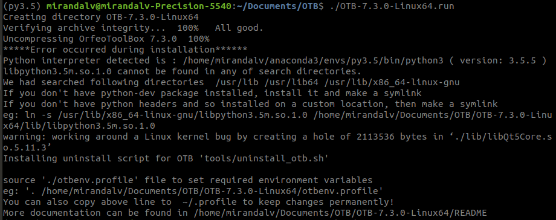

# OTB Set up
This document records the process of setting up orfeo-toolbox on Linux 18.04.5 LTS (Bionic Beaver). 

### Create a virtual environment on Anaconda with python 3.5
Python 3.5 will be installed according to the installation [manual](https://www.orfeo-toolbox.org/CookBook/PythonAPI.html?highlight=python).

```bash
conda create -n py3.5 python=3.5
```
After the initial setting up of python 3.5, activate the virtual environment
```bash
conda activate py3.5
```

### Get the linux orfeo-toolbox
Download the orfeo-toolbox from the [webpage](https://www.orfeo-toolbox.org/download/). The toolbox (OTB-7.3.0-Linux64.run) version that was used to create this document is also in the current folder.

```bash
chmod +x OTB-7.3.0-Linux64.run
./OTB-7.3.0-Linux64.run
```
You may see below errors/warnings after this step.



To solve the error, find the directory where saves the libpython3.5m.so.1.0 file in the virtual environment. 
Use the find command on Linux, and then create a symbolic link to this file.

```bash
find /home/mirandalv/anaconda3/ -iname *libpython3.5*
```


Below information can be referred by [here](https://linuxize.com/post/how-to-create-symbolic-links-in-linux-using-the-ln-command/).
```bash
ln -s /home/mirandalv/anaconda3/envs/py3.5/lib/libpython3.5m.so.1.0 /home/mirandalv/Documents/OTB/OTB-7.3.0-Linux64/lib/libpython3.5m.so.1.0
```

### Use the toolbox with Python bindings
According to the installation [instruction](https://www.orfeo-toolbox.org/CookBook/Installation.html).
By default, bindings for Python 3.5 will be enabled with the otbenv script.

When import the otbApplication API, the error below below may encounter:
```bash
ImportError: libpython3.5m.so.rh-python35-1.0: cannot open shared object file: No such file or directory
```
Create a symlink:

```bash
ln -s /home/mirandalv/anaconda3/envs/py3.5/lib/libpython3.5m.so /home/mirandalv/Documents/OTB/OTB-7.3.0-Linux64/lib/libpython3.5m.so.rh-python35-1.0
```
*Note: the second directory is to the lib folder under the OTB package.

Reference [sources](https://gitlab.orfeo-toolbox.org/orfeotoolbox/otb/-/issues/1540#note_67864).


# Segmentation resources
 
####[Making use of GDAL, RSGISLib and OTB with Python](https://clubgis.net/scripting-and-programming/2015/09/making-use-gdal-rsgislib-otb-python/2/)

####[Orfeo toobox documentation - Nov 2014](https://www.orfeo-toolbox.org/packages/OTBCourses.pdf)

####[Orfeo software guides - Dec 2018](https://www.orfeo-toolbox.org/SoftwareGuide/index.html)


